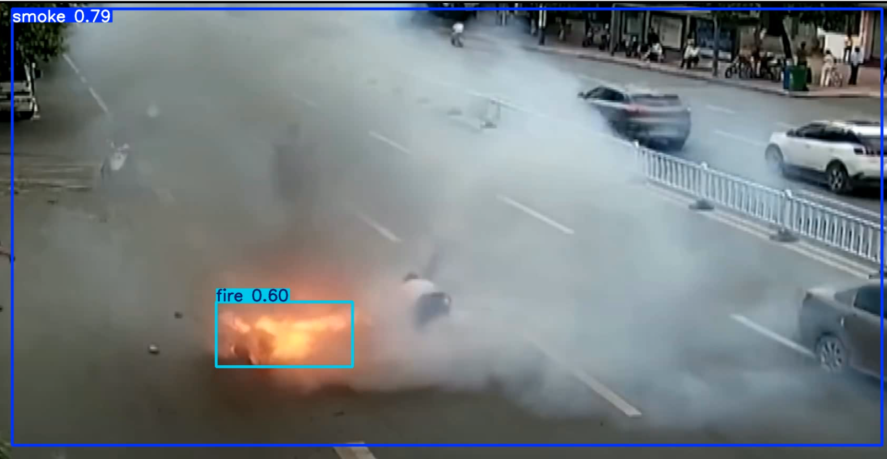
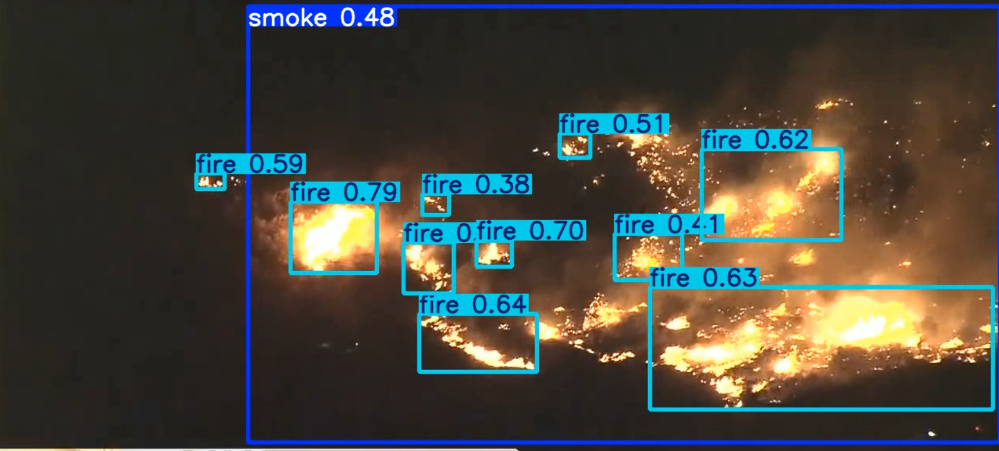
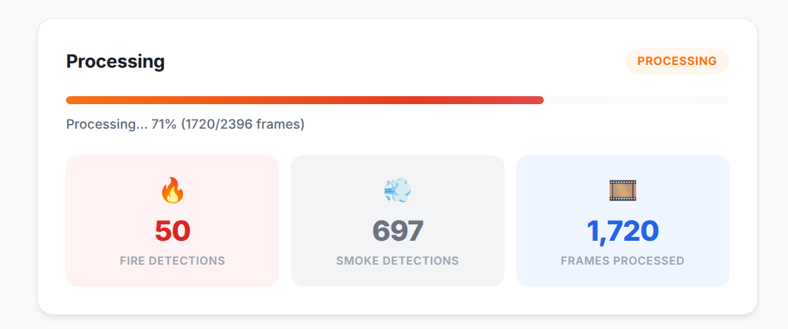

# FireGuard AI

**Real-time fire and smoke detection system powered by YOLO11s deep learning.**

FireGuard AI is an end-to-end computer vision pipeline that detects fire and smoke in video footage using a fine-tuned YOLO11s object detection model. It includes a production-ready Flask web application for video upload, YouTube URL processing, and real-time detection with live progress streaming.

---

## Table of Contents

- [Overview](#overview)
- [Detection Results](#detection-results)
- [Web Application](#web-application)
- [Model](#model)
- [Architecture](#architecture)
- [Features](#features)
- [Tech Stack](#tech-stack)
- [Project Structure](#project-structure)
- [Installation](#installation)
- [Usage](#usage)
- [API Endpoints](#api-endpoints)
- [Configuration](#configuration)
- [License](#license)

---

## Overview

FireGuard AI addresses the critical need for automated fire detection in surveillance and monitoring systems. The system processes video input frame-by-frame through a fine-tuned YOLO11s model trained at 608x608 resolution, producing annotated output with bounding boxes and confidence scores for both fire and smoke classes.

**Key Metrics:**
| Metric | Value |
|--------|-------|
| Model | YOLO11s (fine-tuned) |
| Input Resolution | 608 x 608 |
| Classes | Fire, Smoke |
| mAP50 | 78.9% |
| Inference | Real-time (GPU/CPU) |

---

## Detection Results

### Urban Fire Detection
The model accurately identifies both fire and smoke in complex urban surveillance scenarios, distinguishing between active flames and smoke dispersion patterns.



### Wildfire Detection
Multi-instance detection across large-scale wildfire scenes, identifying individual fire regions with varying confidence levels alongside smoke coverage.



---

## Web Application

The included Flask web application provides a complete interface for video analysis with real-time progress tracking and detection statistics.



**Interface Features:**
- Drag-and-drop video upload (MP4, AVI, MOV, MKV, WebM, FLV, WMV)
- YouTube URL input for direct video processing
- Adjustable confidence and IoU thresholds
- Live progress bar with frame-by-frame updates
- Real-time fire and smoke detection counters
- Downloadable annotated output video

---

## Model

The pre-trained YOLO11s model is hosted on Kaggle:

**[FireGuard AI Model on Kaggle](https://www.kaggle.com/models/punitkashyap2007/fire-guard-ai)**

Download `best.pt` from the Kaggle model page and place it in the project root directory before running the application.

---

## Architecture

```
Video Input --> Frame Extraction --> YOLO11s Inference --> Annotation --> H.264 Encoding --> Output
                                         |
                                    [best.pt model]
                                    608x608 resolution
                                    Fire + Smoke classes
```

The pipeline uses a cached model singleton with thread-safe loading, streaming prediction for memory-efficient video processing, and FFmpeg-based H.264 encoding for browser-compatible output.

---

## Features

- **Real-Time Detection** -- Frame-by-frame fire and smoke detection with bounding boxes and confidence scores
- **Dual Input Modes** -- Upload local video files or paste YouTube URLs for direct processing
- **Live Progress Streaming** -- Server-Sent Events (SSE) for real-time progress updates without polling
- **Configurable Thresholds** -- Adjustable confidence (0.05-0.95) and IoU (0.05-0.95) parameters
- **Thread-Safe Model Caching** -- Single model load with global caching for concurrent request handling
- **H.264 Output Encoding** -- FFmpeg post-processing for universal browser playback compatibility
- **Detection Statistics** -- Per-frame fire and smoke detection counts with summary reporting

---

## Tech Stack

| Component | Technology |
|-----------|------------|
| Object Detection | Ultralytics YOLO11s |
| Backend | Flask (Python) |
| Frontend | HTML5, CSS3, JavaScript |
| Video Processing | OpenCV, FFmpeg |
| YouTube Download | yt-dlp |
| Progress Streaming | Server-Sent Events (SSE) |
| Typography | Inter (Google Fonts) |

---

## Project Structure

```
fireGaurd_ai/
|-- best.pt                          # YOLO11s model weights (download from Kaggle)
|-- fireguard-ai.ipynb               # Training notebook
|-- samples/
|   |-- sample_image1.png            # Urban fire detection sample
|   |-- sample_image2.png            # Wildfire detection sample
|   |-- webapp_ui.png                # Web application screenshot
|-- webapp/
|   |-- app.py                       # Flask backend with detection pipeline
|   |-- templates/
|   |   |-- index.html               # Web application interface
|   |-- static/
|   |   |-- css/
|   |   |   |-- style.css            # Application stylesheet
|   |   |-- js/
|   |       |-- app.js               # Frontend logic and SSE handling
|   |-- uploads/                     # Temporary upload directory (auto-created)
|-- .gitignore
|-- README.md
```

---

## Installation

### Prerequisites

- Python 3.8 or higher
- FFmpeg (for video encoding)

### Setup

1. **Clone the repository:**

```bash
git clone https://github.com/punitxdev/fire_detection_model.git
cd fire_detection_model
```

2. **Install dependencies:**

```bash
pip install flask ultralytics opencv-python yt-dlp imageio-ffmpeg
```

3. **Download the model weights:**

Download `best.pt` from the [Kaggle model page](https://www.kaggle.com/models/punitkashyap2007/fire-guard-ai) and place it in the project root directory.

4. **Run the application:**

```bash
cd webapp
python app.py
```

5. **Open in browser:**

Navigate to `http://localhost:5000`

---

## Usage

1. Open the web application at `http://localhost:5000`
2. Select input mode: **Upload Video** or **YouTube URL**
3. Optionally adjust detection parameters (confidence threshold, IoU threshold)
4. Click **Start Detection** to begin processing
5. Monitor real-time progress with live fire and smoke detection counts
6. Download the annotated output video when processing completes

---

## API Endpoints

| Method | Endpoint | Description |
|--------|----------|-------------|
| GET | `/` | Web application interface |
| POST | `/api/upload` | Upload video file for detection |
| POST | `/api/youtube` | Submit YouTube URL for detection |
| GET | `/api/status/<job_id>` | SSE stream for job progress |
| GET | `/outputs/<filename>` | Serve processed output videos |

### Upload Request

```bash
curl -X POST http://localhost:5000/api/upload \
  -F "video=@input.mp4" \
  -F "conf=0.30" \
  -F "iou=0.50"
```

### YouTube Request

```bash
curl -X POST http://localhost:5000/api/youtube \
  -H "Content-Type: application/json" \
  -d '{"url": "https://youtube.com/watch?v=...", "conf": 0.30, "iou": 0.50}'
```

---

## Configuration

| Parameter | Default | Range | Description |
|-----------|---------|-------|-------------|
| Confidence Threshold | 0.30 | 0.05 - 0.95 | Minimum confidence score for detections |
| IoU Threshold | 0.50 | 0.05 - 0.95 | Non-Maximum Suppression overlap threshold |
| Inference Size | 608 | -- | Input resolution matching training resolution |
| Max Upload Size | 500 MB | -- | Maximum file size for video uploads |

---

## License

This project is open source and available under the [MIT License](LICENSE).
